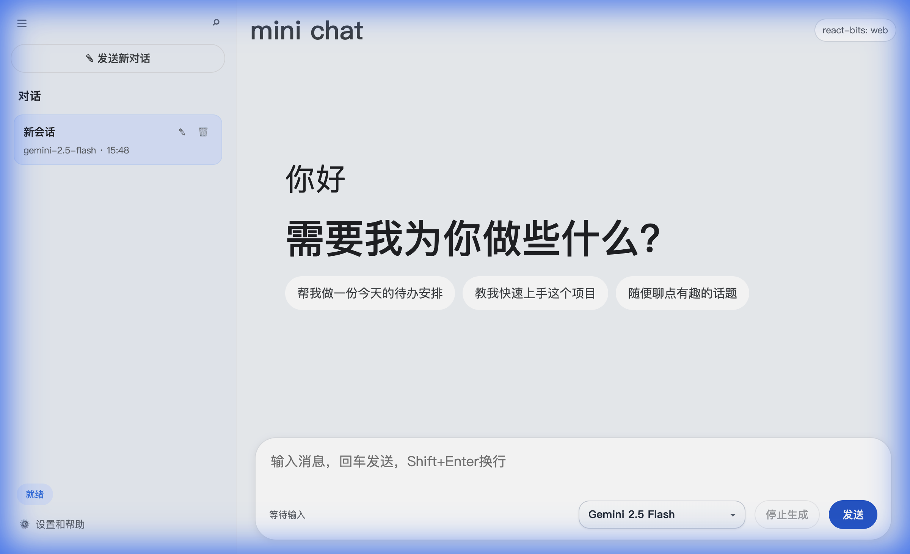
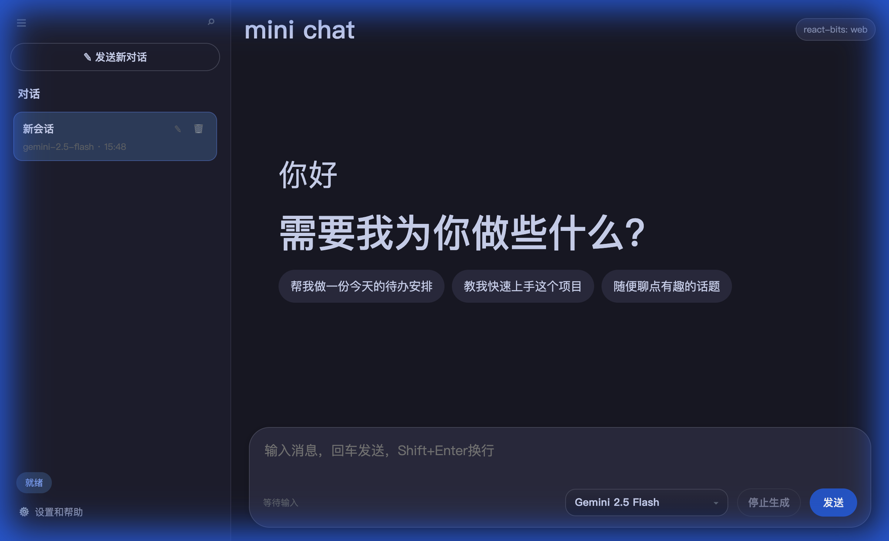
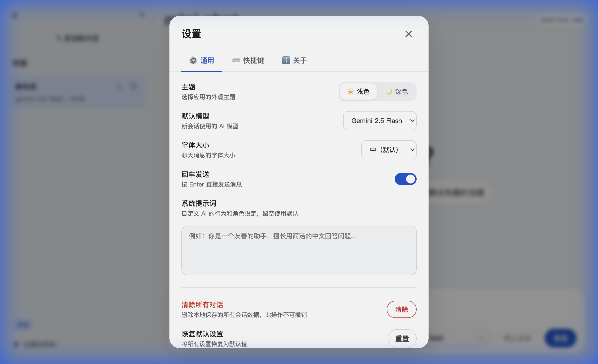

<div align="center">

# 💬 Mini Chat AI

**极简而强大的 AI 对话应用**

[](https://react.dev/)
[](https://vitejs.dev/)
[](https://nodejs.org/)
[](https://ai.google.dev/)

零框架后端 · 真流式响应 · 深色模式 · 多会话管理

[快速开始](#-快速开始) · [功能特性](#-功能特性) · [技术架构](#-技术架构) · [项目结构](#-项目结构)

</div>

---

## 📸 预览

<table>
  <tr>
    <td width="50%">
      
      <p align="center"><strong>☀️ 浅色主题</strong></p>
    </td>
    <td width="50%">
      
      <p align="center"><strong>🌙 深色主题</strong></p>
    </td>
  </tr>
</table>

<details>
  <summary>⚙️ 设置面板预览</summary>
  <br/>
  <div align="center">
    
  </div>
</details>

---

## ✨ 功能特性

### 核心体验

| 功能 | 说明 |
|------|------|
| ⚡ **真流式对话** | 基于 Gemini `streamGenerateContent` 的逐 Token 流式输出，首字到达时间极短 |
| 📝 **Markdown 渲染** | AI 回复支持代码块、表格、列表、引用等完整 Markdown 格式 |
| 💬 **多会话管理** | 创建、搜索、重命名、删除会话，数据自动持久化 |
| 🌗 **深色模式** | 精心调校的 Catppuccin 风格暗色主题，一键切换 |
| ⌨️ **智能输入** | Enter 发送 / Shift+Enter 换行，可在设置中关闭 |

### 设置面板

| 模块 | 功能 |
|------|------|
| ⚙️ **通用** | 主题切换、默认模型、字体大小、回车发送开关、系统提示词 |
| ⌨️ **快捷键** | 键盘快捷操作速查 |
| ℹ️ **关于** | 版本信息、技术栈、项目链接 |

### 更多亮点

- 🛡️ **错误边界** — React Error Boundary 优雅处理异常
- 🔒 **请求限制** — 1MB 请求体上限防止内存溢出
- 🌐 **CORS 支持** — 开发模式跨域无缝衔接
- 🎯 **消息追踪** — 每条消息携带 UUID 和时间戳
- ⏳ **加载动画** — 等待首个 Token 时显示弹跳点动画
- 📦 **零框架后端** — 不依赖 Express/Koa，纯 Node.js 原生 `http`

---

## 🚀 快速开始

### 前置要求

- [Node.js](https://nodejs.org/) ≥ 18
- [Google AI API Key](https://aistudio.google.com/apikey)

### 1. 克隆 & 安装

```bash
git clone https://github.com/Tyleronthebase/chat-mini-ai.git
cd chat-mini-ai
npm install
```

### 2. 配置环境变量

```bash
cp .env.example .env
```

编辑 `.env`：

```dotenv
GOOGLE_API_KEY=your_api_key_here   # 必填：Google AI API Key
USE_REMOTE=1                        # 1 = 调用远程 API，0 = 本地 Mock
GOOGLE_MODEL=gemini-2.5-flash       # 默认模型
PORT=5173                           # 服务端口
```

### 3. 启动开发

```bash
# 终端 1 — Vite 前端热更新
npm run dev

# 终端 2 — Node.js 后端
npm start
```

打开 **http://localhost:5173** 开始聊天 🎉

### 4. 生产部署

```bash
npm run build    # 构建前端 → public/
npm start        # 启动全栈服务
```

---

## 🏗 技术架构

```
┌─────────────────────────────────────────────────────────┐
│                        Client                           │
│  React 18 + Vite + react-markdown + react-bits          │
│                                                         │
│  ┌──────────┐  ┌──────────┐  ┌──────────┐              │
│  │ Sidebar  │  │ ChatPane │  │ Composer │              │
│  └────┬─────┘  └────┬─────┘  └────┬─────┘              │
│       │              │             │                     │
│  ┌────┴──────────────┴─────────────┴─────┐              │
│  │  useSessions  ·  useChat  ·  useSettings │           │
│  └───────────────────┬───────────────────┘              │
└──────────────────────┼──────────────────────────────────┘
                       │  SSE Stream / JSON API
┌──────────────────────┼──────────────────────────────────┐
│                   Server                                │
│  Node.js native http · CORS · MIME · Body Limit         │
│                                                         │
│  ┌──────────┐  ┌──────────┐                             │
│  │ chat.js  │  │storage.js│                             │
│  │ Gemini   │  │ JSON FS  │                             │
│  └────┬─────┘  └──────────┘                             │
└───────┼─────────────────────────────────────────────────┘
        │  streamGenerateContent
┌───────┴─────────────────────────────────────────────────┐
│              Google Gemini API                          │
└─────────────────────────────────────────────────────────┘
```

---

## 📂 项目结构

```text
chat-mini-ai/
├── web/                          # React 前端 (Vite Root)
│   ├── src/
│   │   ├── components/
│   │   │   ├── ChatPane.jsx      # 消息展示区 + Markdown 渲染
│   │   │   ├── Composer.jsx      # 输入框 + 模型选择器
│   │   │   ├── Sidebar.jsx       # 会话列表 + 搜索 + 折叠
│   │   │   ├── SettingsModal.jsx # 设置面板 (3 Tab)
│   │   │   └── ErrorBoundary.jsx # 错误边界
│   │   ├── hooks/
│   │   │   ├── useSessions.js    # 会话 CRUD + 持久化
│   │   │   ├── useChat.js        # 流式通信 + 中止控制
│   │   │   └── useSettings.js    # 设置管理 + 主题切换
│   │   ├── App.jsx               # 组合根 (~70 行)
│   │   ├── main.jsx              # 入口 + ErrorBoundary
│   │   └── styles.css            # 全局样式 + 深色主题
│   └── index.html
├── src/                          # 后端逻辑
│   ├── chat.js                   # Gemini 流式调用 (async generator)
│   └── storage.js                # 按 sessionId 分文件存储
├── server.js                     # 原生 HTTP 服务器
├── docs/                         # 文档资源
├── tests/                        # 测试
│   ├── smoke.js                  # 流式 API 冒烟测试
│   └── storage.js                # 存储层测试
└── vite.config.mjs               # Vite 配置
```

---

## 🧪 测试

```bash
npm test
```

运行 `smoke.js`（流式 API 验证）和 `storage.js`（持久化验证）两组测试。

---

## 🗺️ 路线图

- [ ] 🔊 语音输入/输出
- [ ] 📎 图片/文件上传
- [ ] 🧠 对话记忆 & 上下文窗口管理
- [ ] 🌍 多语言界面
- [ ] 📱 移动端响应式优化
- [ ] 🔗 分享对话链接

---

## ❤️ 致谢

<table>
  <tr>
    <td align="center"><a href="https://react.dev/"><strong>React</strong></a><br/>用户界面库</td>
    <td align="center"><a href="https://vitejs.dev/"><strong>Vite</strong></a><br/>构建工具</td>
    <td align="center"><a href="https://ai.google.dev/"><strong>Gemini</strong></a><br/>AI 模型</td>
    <td align="center"><a href="https://github.com/DavidHDev/react-bits"><strong>react-bits</strong></a><br/>动效组件</td>
    <td align="center"><a href="https://nodejs.org/"><strong>Node.js</strong></a><br/>运行时</td>
  </tr>
</table>

---

<div align="center">

**Designed with ❤️ by Tyler**

<sub>如果觉得有帮助，请给个 ⭐ Star 支持一下！</sub>

</div>
