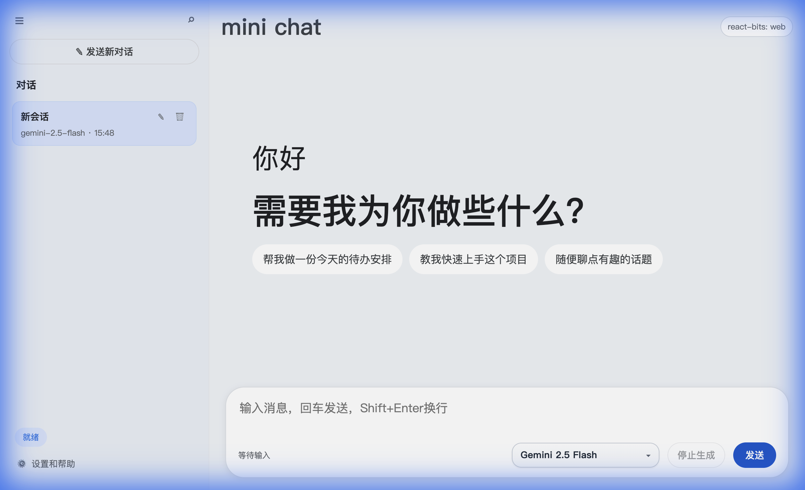
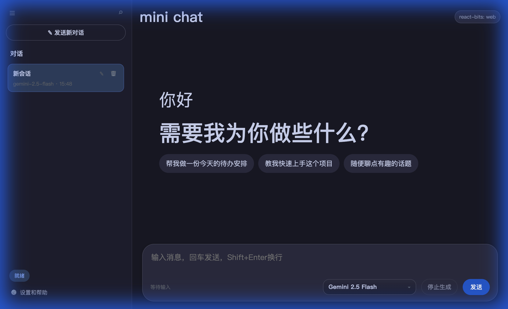
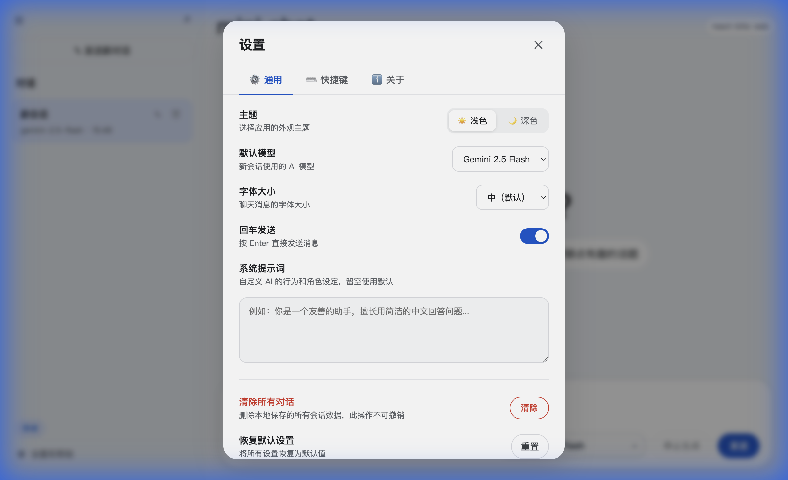

<div align="center">

# 💬 Mini Chat AI

**极简而强大的 AI 对话应用**

[](https://react.dev/)
[](https://vitejs.dev/)
[](https://nodejs.org/)
[](https://platform.openai.com/)

前端直连 API · 真流式响应 · 深色模式 · 多会话管理

[快速开始](#-快速开始) · [功能特性](#-功能特性) · [技术架构](#-技术架构) · [项目结构](#-项目结构)

</div>

---

## 📸 预览

<table>
  <tr>
    <td width="50%">
      
      <p align="center"><strong>☀️ 浅色主题</strong></p>
    </td>
    <td width="50%">
      
      <p align="center"><strong>🌙 深色主题</strong></p>
    </td>
  </tr>
</table>

<details>
  <summary>⚙️ 设置面板预览</summary>
  <br/>
  <div align="center">
    
  </div>
</details>

---

## ✨ 功能特性

### 核心体验

| 功能 | 说明 |
|------|------|
| ⚡ **前端直连 API** | 浏览器直接调用 OpenAI 兼容 API，无代理缓冲，流式体验丝滑 |
| 📝 **Markdown 渲染** | AI 回复支持代码块、表格、列表、引用等完整 Markdown 格式 |
| 💬 **多会话管理** | 创建、搜索、重命名、删除会话，数据自动持久化 |
| 🌗 **深色模式** | 精心调校的 Catppuccin 风格暗色主题，一键切换 |
| 📎 **多模态输入** | 支持拖拽、点击上传图片（需 API 模型支持 Vision） |
| 🎙️ **智能语音** | 全新语音交互：录音波浪动画、语音发送指令（“发送”），及 AI 语音朗读 |
| 🛠️ **消息快捷操作** | AI 回复悬停支持：点赞/点踩、一键复制、导出 Markdown/TXT |

### API 接入（3 种模式）

| 模式 | 说明 |
|------|------|
| ⚡ **直连模式** | 前端直接调用 OpenAI 兼容 API（推荐，支持 VoAPI / OneAPI 等中转站） |
| 🧪 **Mock 模式** | 模拟流式输出，用于测试前端渲染效果，无需 API Key |
| 🔄 **后端代理** | 通过 Node.js 后端中转，API Key 配置在 `.env` 中 |

> 💡 在 **设置 → API** 标签中一键切换模式，直连模式下 API 地址和密钥保存在本地浏览器中。

### 设置面板

| 模块 | 功能 |
|------|------|
| ⚙️ **通用** | 主题切换、默认模型、字体大小、回车发送开关、系统提示词 |
| 🔑 **API** | 接入模式切换、API 地址 / 密钥配置、连接状态检测 |
| ⌨️ **快捷键** | 键盘快捷操作速查 |
| ℹ️ **关于** | 版本信息、技术栈、项目链接 |

### 更多亮点

- 🟢 **智能状态指示** — 5 级连接状态检测（就绪 / 生成中 / 请求失败 / 服务不可用 / 离线）
- 🛡️ **错误边界** — React Error Boundary 优雅处理异常
- 🔒 **请求限制** — 1MB 请求体上限防止内存溢出
- 🎯 **消息追踪** — 每条消息携带 UUID 和时间戳
- ⏳ **加载动画** — 等待首个 Token 时显示弹跳点动画
- 📦 **零框架后端** — 不依赖 Express/Koa，纯 Node.js 原生 `http`

---

## 🚀 快速开始

### 前置要求

- [Node.js](https://nodejs.org/) ≥ 18
- 任意 OpenAI 兼容 API Key（[VoAPI](https://demo.voapi.top) / [Google AI](https://aistudio.google.com/apikey) 等）

### 1. 克隆 & 安装

```bash
git clone https://github.com/Tyleronthebase/chat-mini-ai.git
cd chat-mini-ai
npm install
```

### 2. 启动

```bash
# 终端 1 — Vite 前端热更新
npm run dev

# 终端 2 — Node.js 后端
npm start
```

打开 **http://localhost:5173** 🎉

### 3. 配置 API

打开 **设置 → API** 标签：

1. 选择 **⚡ 直连** 模式
2. 输入 API 地址（如 `https://demo.voapi.top`）
3. 输入 API 密钥（`sk-xxx`）
4. 开始聊天！

> 也可以选 **🧪 Mock** 模式，无需任何 Key 即可体验流式输出效果。

### 4. 后端代理模式（可选）

如需使用后端代理模式，配置 `.env` 文件：

```bash
cp .env.example .env
```

```dotenv
GOOGLE_API_KEY=sk-your-api-key       # API 密钥
USE_REMOTE=1                          # 1 = 远程 API，0 = Mock
GOOGLE_MODEL=gemini-2.5-flash         # 默认模型
GOOGLE_API_BASE=https://demo.voapi.top  # API 地址（留空用 Google 原生）
PORT=3001                             # 后端端口
```

### 5. 生产部署

```bash
npm run build    # 构建前端 → public/
npm start        # 启动全栈服务
```

---

## 🏗 技术架构

```
┌─────────────────────────────────────────────────────────┐
│                        Client                           │
│  React 18 + Vite + react-markdown + react-bits          │
│                                                         │
│  ┌──────────┐  ┌──────────┐  ┌──────────┐              │
│  │ Sidebar  │  │ ChatPane │  │ Composer │              │
│  └────┬─────┘  └────┬─────┘  └────┬─────┘              │
│       │              │             │                     │
│  ┌────┴──────────────┴─────────────┴─────────────┐      │
│  │ useSessions · useChat · useSettings            │      │
│  │ useConnectionStatus · useSpeechRecognition     │      │
│  │ useSpeechSynthesis                             │      │
│  └──────────┬────────────────────┬────────────────┘      │
└─────────────┼────────────────────┼──────────────────────┘
              │                    │
   ⚡ 直连模式 │         🔄 代理模式 │
              ▼                    ▼
┌─────────────────────┐  ┌─────────────────────────────┐
│  OpenAI-Compatible  │  │         Server               │
│  API (VoAPI, etc.)  │  │  Node.js http · chat.js      │
│  /v1/chat/completions│  │  storage.js · /api/health   │
└─────────────────────┘  └──────────┬──────────────────┘
                                    │
                         ┌──────────▼──────────────────┐
                         │   OpenAI / Gemini API       │
                         └─────────────────────────────┘
```

---

## 📂 项目结构

```text
chat-mini-ai/
├── web/                          # React 前端 (Vite Root)
│   ├── src/
│   │   ├── components/
│   │   │   ├── ChatPane.jsx      # 消息展示区 + Markdown 渲染
│   │   │   ├── Composer.jsx      # 输入框 + 模型选择器 + 语音/图片
│   │   │   ├── Sidebar.jsx       # 会话列表 + 搜索 + 状态指示
│   │   │   ├── SettingsModal.jsx # 设置面板 (4 Tab)
│   │   │   ├── MessageActions.jsx# 消息快捷操作 (复制/导出/朗读)
│   │   │   └── ErrorBoundary.jsx # 错误边界
│   │   ├── hooks/
│   │   │   ├── useSessions.js    # 会话 CRUD + 持久化
│   │   │   ├── useChat.js        # 3 模式流式通信 + 中止控制
│   │   │   ├── useSettings.js    # 设置管理 + API 配置
│   │   │   ├── useConnectionStatus.js # 5 级连接状态检测
│   │   │   ├── useSpeechRecognition.js# 语音转文字 (STT)
│   │   │   └── useSpeechSynthesis.js  # 文本转语音 (TTS)
│   │   ├── App.jsx               # 组合根
│   │   ├── main.jsx              # 入口 + ErrorBoundary
│   │   └── styles.css            # 全局样式 + 深色主题 + 动画
│   └── index.html
├── src/                          # 后端逻辑
│   ├── chat.js                   # Gemini + OpenAI 双格式流式调用
│   └── storage.js                # 按 sessionId 分文件存储
├── server.js                     # 原生 HTTP 服务器 + /api/health
├── docs/                         # 文档资源
├── tests/                        # 测试
│   ├── smoke.js                  # 流式 API 冒烟测试
│   └── storage.js                # 存储层测试
└── vite.config.mjs               # Vite 配置 + API 代理
```

---

## 🧪 测试

```bash
npm test
```

运行 `smoke.js`（流式 API 验证）和 `storage.js`（持久化验证）两组测试。

---

## 🗺️ 路线图

- [x] ⚡ 前端直连 API（无后端代理）
- [x] 🧪 Mock 模式测试渲染
- [x] 🟢 智能连接状态检测
- [x] 🔊 语音输入/输出 (支持语音指令发送)
- [x] 📎 图片/文件上传 (多模态 Vision 支持)
- [ ] 🧠 对话记忆 & 上下文窗口管理
- [ ] 🌍 多语言界面
- [ ] 📱 移动端响应式优化

---

## ❤️ 致谢

<table>
  <tr>
    <td align="center"><a href="https://react.dev/"><strong>React</strong></a><br/>用户界面库</td>
    <td align="center"><a href="https://vitejs.dev/"><strong>Vite</strong></a><br/>构建工具</td>
    <td align="center"><a href="https://ai.google.dev/"><strong>Gemini</strong></a><br/>AI 模型</td>
    <td align="center"><a href="https://github.com/DavidHDev/react-bits"><strong>react-bits</strong></a><br/>动效组件</td>
    <td align="center"><a href="https://nodejs.org/"><strong>Node.js</strong></a><br/>运行时</td>
  </tr>
</table>

---

<div align="center">

**Designed with ❤️ by Tyler**

<sub>如果觉得有帮助，请给个 ⭐ Star 支持一下！</sub>

</div>
